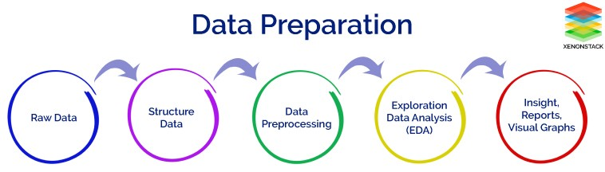

# EDA Final Project — Student Guide

**MFR Data Analytics Program · Module 9 — Exploratory Data Analysis (EDA)**




This document is the official brief for your **final EDA project**. It combines the full project workflow (topic, data sourcing, dashboard, presentation) with the **six-section notebook structure** used across the program.

The goal is not to build a predictive model. You will **understand the data**, document your process, and communicate **clear, evidence-based insights** to a non-technical audience.

---

## What this project demonstrates

By completing this project you show that you can:

| Module skill | What you demonstrate |
|--------------|----------------------|
| **Python & Pandas** | Load, explore, and manipulate a real dataset using pandas and numpy |
| **Data cleaning** | Identify and handle missing values, outliers, type errors, and inconsistencies |
| **Statistics** | Apply descriptive statistics and, where relevant, basic inference or hypothesis testing |
| **Visualisation** | Create clear, well-labelled charts using matplotlib, seaborn, and/or plotly |
| **EDA** | Use histograms, boxplots, pairplots, heatmaps, time series, and correlation analysis |
| **Storytelling** | Communicate findings in a structured, narrative format (notebook, dashboard, presentation) |

---

## Before you start: choose your topic and dataset

### 1. Choose a topic

Decide what you want this project to be about — something you can explain in one sentence.

**Examples:** public health, sports, housing, climate, education, crime, tourism, customer behaviour, energy, transport, etc.

Write down in your notebook:

- Your **research goal** (what you want to learn or show)
- **Why** you chose this topic (interest, career, impact, curiosity)

### 2. Find a data source

Locate one or more datasets that support your topic. Data must be **real**, **public**, and **documented** (you can explain where it came from and what each column means).

**Dataset requirements (all must be met):**

| Requirement | Detail |
|-------------|--------|
| **Size** | At least **5,000 rows** and **8 columns** |
| **Time** | At least one **date/time** column |
| **Variable types** | At least one **categorical** and one **numerical** variable |
| **Ethics** | Publicly available; **no personal or sensitive data** (PII) |
| **Originality** | **Not** used in course mini-projects — e.g. no Superstore, no coffee shop, no HR data |

### Where to find data — suggested sources

Use the lists below as a starting point. Prefer **ready-made datasets** (CSV, JSON, Parquet) when you are new to APIs or web scraping.

**Before you download anything, check:**

- **License** — Can you use it for an academic project? Do you need to attribute the source?
- **Documentation** — Is there a data dictionary or README explaining each column?
- **Ethics** — No personal or sensitive data (see requirements above). Do **not** submit datasets built from your own messages, location history, or private accounts.
- **Feasibility** — Many APIs require registration, rate limits, or payment. Confirm with your mentor if access is realistic for your timeline.

---

**General repositories & dataset search**

| Source | What you will find |
|--------|-------------------|
| [Kaggle Datasets](https://www.kaggle.com/datasets) | Large catalogue; competitions often include rich, cleaned datasets |
| [Google Dataset Search](https://datasetsearch.research.google.com/) | Meta-search across many open datasets |
| [UCI Machine Learning Repository](https://archive.ics.uci.edu/datasets) | Classic, well-documented academic datasets |
| [Our World in Data](https://ourworldindata.org) | Global topics: health, economy, environment (often CSV-ready) |
| [Papers with Code — Datasets](https://paperswithcode.com/datasets) | Datasets linked to research papers |
| [Data Commons](https://datacommons.org/) | Integrated public statistics from many providers |
| [Gapminder](https://www.gapminder.org/data/) | Global development indicators, easy to explore |
| [data.gov](https://www.data.gov) | United States federal open data |

---

**Spain — national & regional open data**

| Source | What you will find |
|--------|-------------------|
| [datos.gob.es](https://datos.gob.es/) | National open-data portal (catalogue across ministries and regions) |
| [INE](https://www.ine.es/nomen2/ficheros.do) | Official statistics (demography, labour, prices, etc.) |
| [Open data — Ministry of Finance](https://www.hacienda.gob.es/es-ES/GobiernoAbierto/Datos%20Abiertos/Paginas/Catalogodedatosabiertos.aspx) | Budget, public sector, transparency datasets |
| [Red.es open data](https://www.red.es/redes/es/que-hacemos/datos-abiertos) | Connectivity, infrastructure, digital economy |
| [ESRI Open Data Spain](https://opendata.esri.es/) | Geospatial and thematic layers (maps, boundaries, facilities) |
| [epdata.es](https://www.epdata.es/) | Spanish open data for journalism and analysis |
| [Ayuntamiento de Madrid](https://datos.madrid.es/portal/site/egob/) | Transport, environment, municipal services |
| [Barcelona Open Data](https://opendata-ajuntament.barcelona.cat/es) | Mobility, tourism, urban indicators |
| [Metro de Madrid (CRTM)](https://data-crtm.opendata.arcgis.com/) | Public transport open data |
| [Spanish cadastre (Catastro)](https://ovc.catastro.meh.es/ovcservweb/OVCSWLocalizacionRC/OVCCoordenadas.asmx) | Property coordinates and cadastral references (technical API) |

---

**Europe & international institutions**

| Source | What you will find |
|--------|-------------------|
| [European Union Open Data Portal](https://data.europa.eu/euodp/es/home) | EU-wide datasets (economy, environment, transport, etc.) |
| [World Bank DataBank](https://databank.worldbank.org/home) | Macroeconomic and development indicators by country |
| [ILOSTAT](https://ilostat.ilo.org/data/country-profiles/) | Labour market and employment statistics |
| [Migration Data Portal](https://migrationdataportal.org/es/node/2955) | International migration flows and stocks |

---

**Maps, mobility & urban topics**

| Source | What you will find |
|--------|-------------------|
| [OpenStreetMap](https://wiki.openstreetmap.org/wiki/API) | Open geographic data (roads, POIs, boundaries); use exports or libraries like `osmnx` |
| [Inside Airbnb](http://insideairbnb.com/index.html) | Room listings and reviews for major cities (popular for housing/tourism EDA) |
| [Google Maps Platform](https://cloud.google.com/maps-platform?hl=es) | Geocoding, places, routes — **API key required**; check free tier and terms |

---

**Finance & markets**

| Source | What you will find |
|--------|-------------------|
| [Python libraries for finance data](https://financetrain.com/best-python-librariespackages-finance-financial-data-scientists/) | Overview of `yfinance`, `pandas-datareader`, etc. |
| [How to get stock data with Python](https://towardsdatascience.com/how-to-get-stock-data-using-python-c0de1df17e75) | Tutorial-style access to historical prices |

Use these for **aggregated, public market data** only. Document the ticker symbols, date range, and library version in your notebook.

---

**APIs & developer platforms**

Many projects can use an API instead of a static file. Read the **terms of service** and whether a **free tier** is enough for your project.

| Source | Notes |
|--------|--------|
| [public-apis (GitHub)](https://github.com/public-apis/public-apis) | Curated list of free/public APIs by category |
| [RapidAPI](https://rapidapi.com/blog/most-popular-api/) | Marketplace; many APIs have a free tier after signup |
| [Idealista — API testigos](https://www.idealista.com/data/productos/desarrollo/api-de-testigos) | Spanish real-estate market data (commercial / restricted access) |
| [Booking.com Developers](https://developers.booking.com/api/index.html) | Hospitality data (partner access; not always open to students) |
| [Tripadvisor Content API](http://developer-tripadvisor.com/content-api/) | Reviews and places (registration required) |
| [Facebook Developers](https://developers.facebook.com/docs/apis-and-sdks?locale=es_ES) | Social/graph APIs — strict policies; often unsuitable for class projects |
| [X (Twitter) Developer](https://developer.twitter.com/en/docs) | Posts and metrics — paid tiers; plan early if you use this |
| [Instagram Developer](https://www.instagram.com/developer/) | Mostly for business/creator accounts; limited public research access |

If an API is blocked or too expensive, switch to a **static open dataset** on the same topic rather than spending weeks on access.

---

**Web scraping & automation**

You may collect data from public web pages using Python (`requests`, `BeautifulSoup`, `Selenium`, etc.) **only if**:

- The site’s **terms of use** allow it (or the data are clearly open government data)
- You respect **robots.txt** and do not overload servers
- You do **not** scrape login-only content, private profiles, or personal data
- You document the URL, date collected, and cleaning steps in the notebook

Ask your mentor before scraping commercial sites (retail, social networks, job boards).

---

**Topics that often work well for EDA**

- **Environment & climate** — Our World in Data, EU portals, municipal open data  
- **Transport** — Madrid/Barcelona/CRTM, OpenStreetMap  
- **Housing & tourism** — Inside Airbnb, cadastre, municipal datasets  
- **Health & demography** — INE, Kaggle public health datasets (e.g. historical epidemic data with clear provenance)  
- **Economy & labour** — World Bank, ILOSTAT, INE  
- **Sports, culture, education** — Kaggle, government cultural open data  

---

**Sources to avoid for this project**

| Do not use | Why |
|------------|-----|
| Course mini-project datasets | Superstore, coffee shop, HR data — already used in class |
| **Your own private data** | Google Timeline, personal phone logs (QPython), private social accounts — privacy and ethics |
| Undocumented scrapes | If you cannot explain columns and collection method, the project will not pass review |
| Datasets without enough rows/columns | See requirements table above |

---

**Quick decision guide**

```text
I want Spanish official statistics     → INE or datos.gob.es
I want a city topic (Madrid/BCN)       → Municipal open-data portals
I want a ready CSV with 5k+ rows       → Kaggle or Google Dataset Search
I want global trends over time         → Our World in Data, World Bank, Gapminder
I want maps or neighbourhoods          → OpenStreetMap, ESRI Spain, Catastro
I need mentor approval                 → Ask early with: link, row count, date column, license
```

Cite every source with **links** in your notebook. **Not sure which dataset to choose?** Ask your mentor for **approval before you start** — share the URL, approximate row count, whether you have a date column, and the license. A dataset that is too clean or too small will limit the depth of your analysis.

---

## Project workflow (high level)

Complete these steps **in order** and document them in your Jupyter notebook:

1. Choose a topic and secure mentor approval for your dataset  
2. Import the data and run initial exploration  
3. Audit data quality (nulls, duplicates, outliers, types, consistency)  
4. Clean and prepare the data (including at least one engineered feature)  
5. Write **at least 10 analytical questions** you believe the data can answer  
6. Answer those questions with visualisations (see Section 4 below)  
7. Build an **interactive dashboard**  
8. Deliver your **oral presentation** (8–12 minutes)

---

## Jupyter notebook structure (required)

Your notebook must follow **six sections**. Each section maps to skills from earlier modules. You may add subsections, but graders must be able to find all required content under these headings.

---

### Section 1: Dataset introduction & initial exploration  
*Modules 2 & 3*

**Tasks:**

- Describe the dataset: what it contains, where it comes from, and why it is interesting  
- Load the data with pandas and display the first rows  
- Check shape, data types, and column names  
- Answer: How many rows? How many columns? What does each column represent?  
- Check for duplicates and summarise with `.describe()` (and value counts for categoricals where useful)

**Deliverable:** A written introduction (markdown cell) + code cells with initial exploration output.

---

### Section 2: Data cleaning & preparation  
*Module 4*

**Tasks:**

- Identify and handle **missing values** (document every decision)  
- Convert columns to the correct **data types** (especially dates)  
- Handle **outliers**: detect them, decide whether to remove or keep, and justify  
- Clean text columns if needed (strip spaces, standardise categories)  
- Create **at least one new feature** through feature engineering (e.g. bins, flags, derived metrics, parsed date parts)

**Deliverable:** A clean, ready-to-analyse `DataFrame` + a written summary of all cleaning decisions. Export cleaned data (e.g. `data_clean.csv`) or clearly mark the final dataframe in the repo.

---

### Section 3: Descriptive statistics  
*Module 3*

**Tasks:**

- Compute **central tendency** and **dispersion** for all key numerical variables  
- Compare group statistics using `groupby`  
- Identify and comment on variables that are **skewed** or have **high variance**  
- Formulate **at least 3 analytical questions** you will investigate in the next sections (these count toward your full list of 10+ questions below)

**Deliverable:** A statistics summary table + at least 3 clearly stated analytical questions.

---

### Section 4: Univariate & multivariate visual exploration  
*Modules 5 & 9*

**Tasks:**

- Plot **histograms** for all key numerical variables — interpret the shape  
- Use **boxplots** to compare distributions across groups  
- Build a **pairplot** and a **correlation heatmap** (Pearson and/or Spearman)  
- Use **at least 5 chart types** from the course (bar, scatter, line, box, heatmap, etc.)  
- Each chart must have a **title**, **axis labels**, and a **written interpretation** below it  
- Your charts should answer the **analytical questions** you wrote (see “Analytical questions” below)

**Deliverable:** **At least 8 visualisations**, each followed by a written interpretation.

---

### Section 5: Time series & correlation analysis  
*Module 9*

**Tasks:**

- **Resample** the data to at least two time frequencies (e.g. monthly and quarterly)  
- Plot a **rolling average** to reveal trend and seasonality  
- Identify and describe **at least one seasonal pattern**  
- Conduct **correlation analysis**: compare Pearson vs Spearman where appropriate and justify your choice  
- Plot a **ranked correlation bar chart** showing what drives your main variable of interest  

**Deliverable:** Time series charts + correlation analysis + short written narrative.

---

### Section 6: Conclusions & recommendations

**Tasks:**

- Summarise your **3–5 most important findings**  
- Explain what **surprised** you and why  
- Provide **2–3 concrete recommendations** based on your analysis (business, policy, or domain-appropriate)  
- Identify **limitations** of your analysis and what you would explore with more time  

**Deliverable:** A clear closing section that a stakeholder could read without running your code.

---

## Analytical questions (required)

**Before** you build your main charts in Sections 4–5, write **at least 10 questions** you believe the data can help answer. Keep the full list in the notebook (Section 3 must include at least 3 of them).

Format them as real questions, not vague topics.

| Weak | Strong |
|------|--------|
| “Sales” | “Which product category had the highest average revenue per transaction in 2023?” |
| “Weather” | “In which months does average rainfall exceed the 10-year monthly median?” |

Your questions should mix:

- **Univariate** — distributions, trends over time  
- **Bivariate** — relationships between two variables  
- **Multivariate / segmented** — patterns within groups, regions, or categories  

Sections 4 and 5 should **directly answer** these questions with evidence from tables and charts.

---

## Interactive dashboard (required)

Create a dashboard that lets someone explore key aspects of your dataset without reading the full notebook.

**Tools (choose one):**

- Streamlit  
- Plotly Dash  
- Power BI / Tableau (if covered in your cohort)  
- Panel or similar  

**Minimum expectations:**

- At least **3** interactive elements (filters, dropdowns, date range, etc.)  
- At least **2** KPIs or summary metrics  
- At least **2** charts linked to the filters  
- A short title and one-line description of what the dashboard shows  

Include **run instructions** in your repo README or in the notebook (how to install dependencies and start the app).

---

## Deliverables

Submit all of the following:

| Deliverable | Description |
|-------------|-------------|
| **Jupyter notebook** | Six sections as defined above |
| **Cleaned data** (recommended) | Exported file or clearly identified final dataframe |
| **Dashboard** | Source code + run instructions |
| **Presentation** | 8–12 minutes (see below) |
| **Requirements file** | `requirements.txt` (or equivalent) listing dependencies |

Push your work to GitHub (or follow your instructor’s submission process) before the deadline.

---

## Presentation guide (8–12 minutes)

Prepare slides or a notebook slideshow. Cover every topic below (not necessarily one slide each).

1. **Goal** — What is the purpose of your project? What question(s) are you trying to answer?  
2. **Topic** — What is the subject? Why did you choose it?  
3. **Data source** — Where did the data come from? Is it real? How trustworthy is it? Any limitations?  
4. **Highlights** — Show your **most interesting** visualisations (not every chart)  
5. **Surprise** — One finding that surprised you or contradicted your expectations  
6. **Usefulness** — Who could use these insights? (business, policy, research, personal decisions)  
7. **Difficulties** — What was hard? (data quality, size, documentation, tooling, time)  
8. **Conclusions** — What can you conclude? What would you do next with more time?  

Practice so you stay within the time limit and can explain charts without reading code line by line.

---

## Tips for success

- Choose a dataset that genuinely interests you — motivation matters for a self-directed project.  
- Prefer data with a **data dictionary**; guessing column meanings wastes time.  
- Keep a **changelog** of cleaning steps in markdown.  
- If a question cannot be answered with your data, say so and state what extra data you would need.  
- Explain one chart to a peer who does not know your topic; if they are confused, simplify.  
- Treat this as a **portfolio piece** for interviews and GitHub.

---

## Checklist before you submit

**Topic & data**

- [ ] Topic and research goal stated clearly  
- [ ] Dataset meets size, time, and variable-type requirements  
- [ ] Dataset is not from a forbidden course mini-project  
- [ ] Mentor approval obtained (if required by your cohort)  
- [ ] Data source cited with link(s)  

**Notebook (Sections 1–6)**

- [ ] Section 1: Introduction and initial exploration  
- [ ] Section 2: Cleaning documented; at least one engineered feature  
- [ ] Section 3: Descriptive statistics + at least 3 analytical questions  
- [ ] Section 4: At least 8 visualisations with interpretations; ≥5 chart types  
- [ ] Section 5: Time series (resample, rolling average, seasonality) + correlation analysis  
- [ ] Section 6: Findings, recommendations, limitations  
- [ ] **At least 10** analytical questions listed; charts answer them  

**Extras**

- [ ] Interactive dashboard included and runnable  
- [ ] Presentation covers all eight presentation topics  
- [ ] `requirements.txt` (or equivalent) included  

Good luck.
